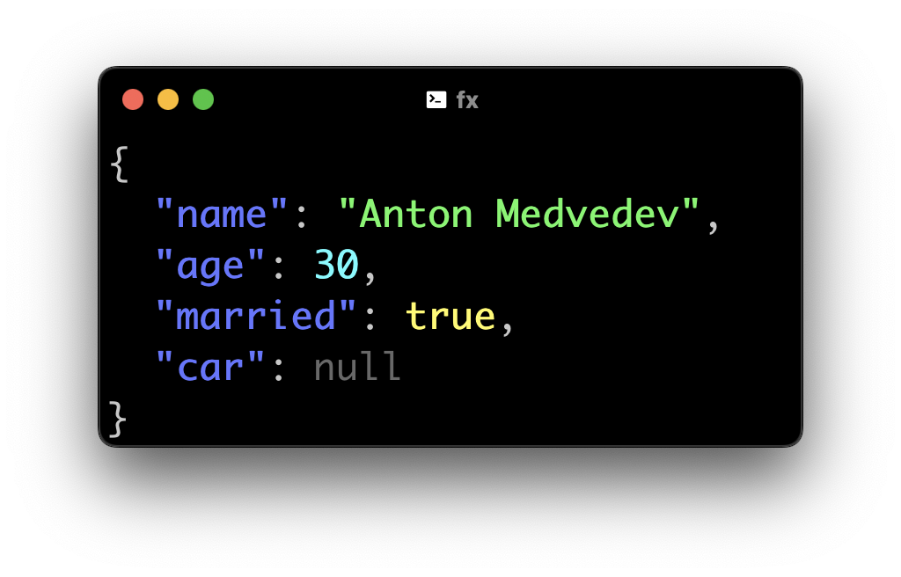
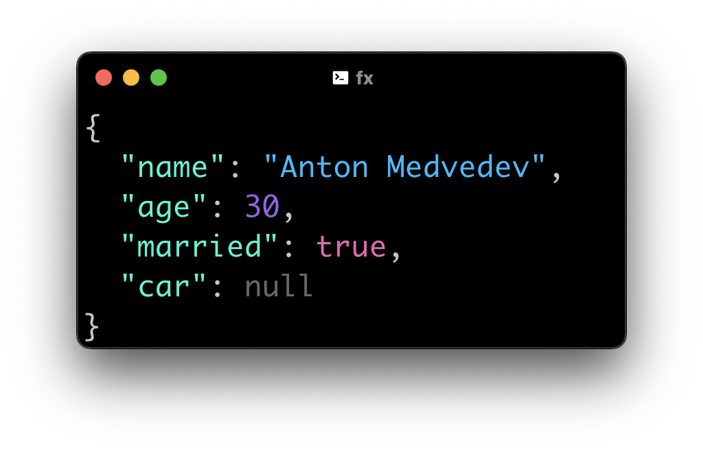
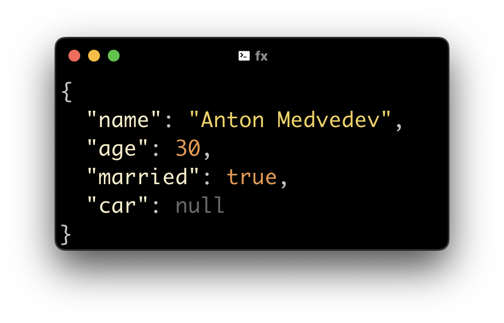
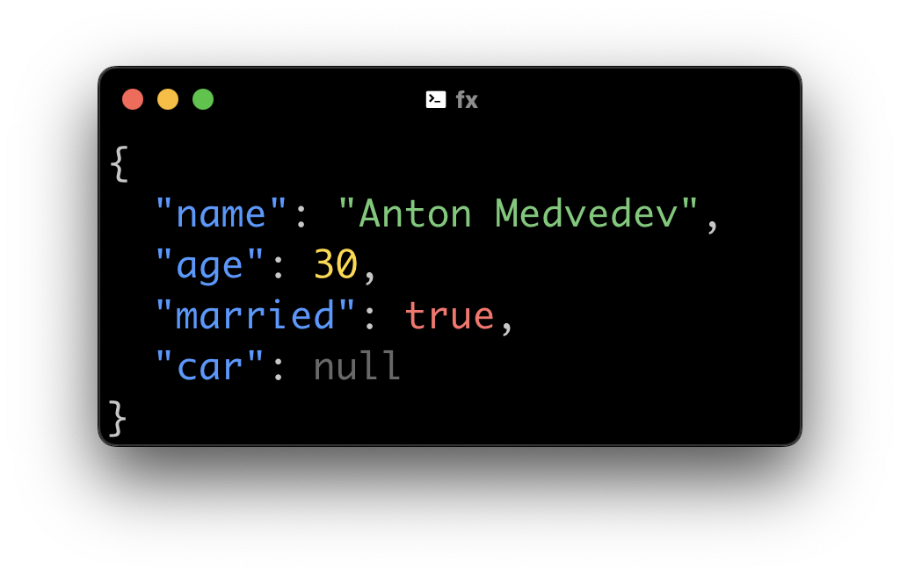
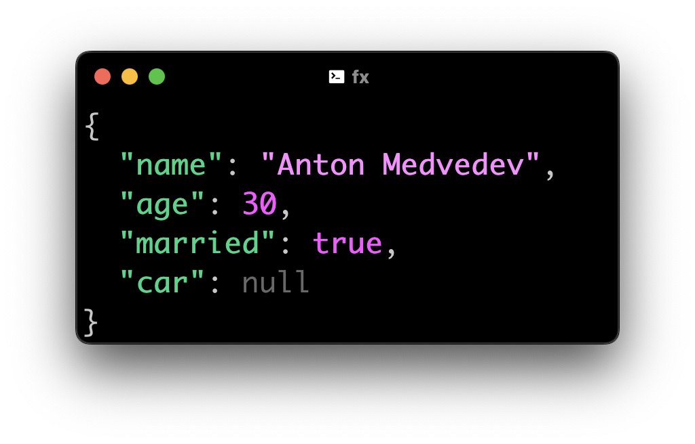
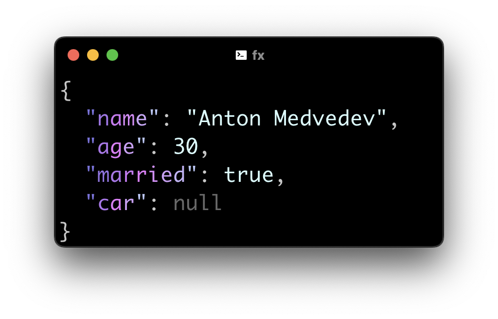
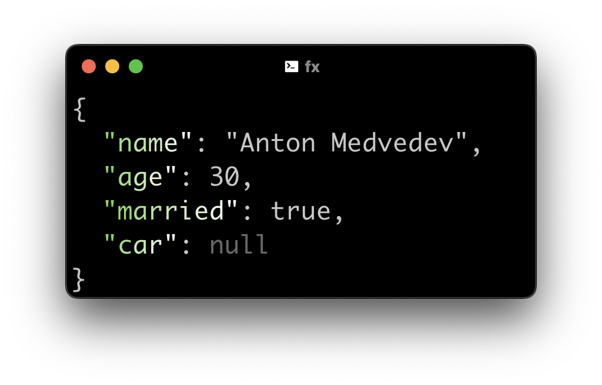
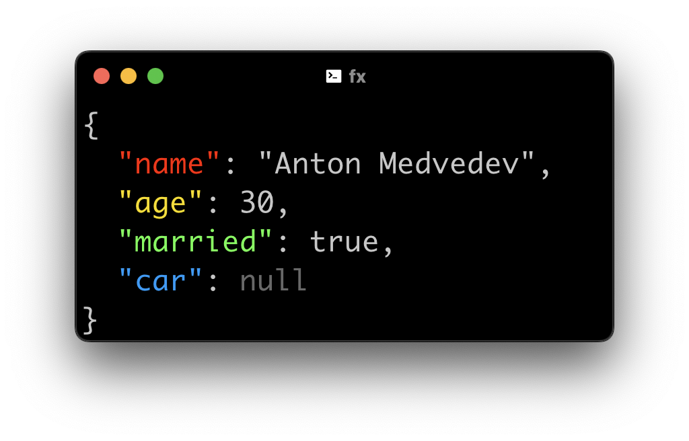
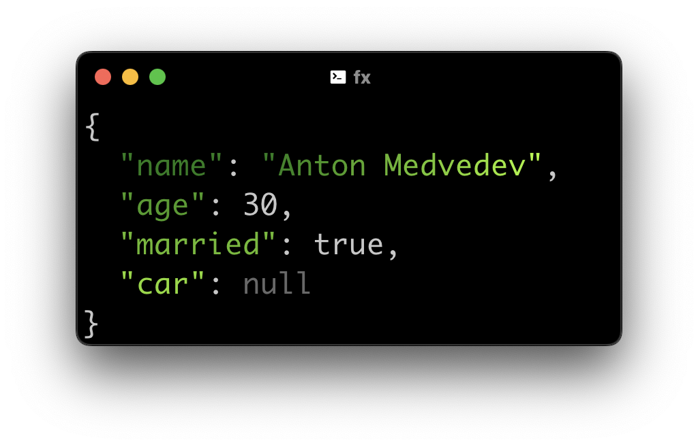

# fx

<p align="center"></p>

_* Function eXecution_

## Install

```bash
go install github.com/antonmedv/fx@latest
```

Or via Homebrew

```bash
TODO
```

Or download [pre-built binary](https://github.com/antonmedv/fx/releases).

## Usage

```bash
$ fx data.json
```

Or

```bash
$ curl ... | fx
```

### Reducers

```bash
$ fx data.json '.filter(x => x.startsWith("a"))'
```

Access all lodash (or ramda, etc) methods by
using [.fxrc](https://github.com/antonmedv/fx/blob/master/DOCS.md#using-fxrc)
file.

```bash
$ fx data.json 'groupBy("commit.committer.name")' 'mapValues(_.size)'
```

Update JSON using spread operator.

```bash
$ echo '{"count": 0}' | fx '{...this, count: 1}'
{
  "count": 1
}
```

Extract values from maps.

```bash
$ fx commits.json | fx .[].commit.author
```

Pretty print.

```bash
$ curl ... | fx .
```

## Documentation

See full [documentation](https://github.com/antonmedv/fx/blob/master/DOCS.md).

## Themes

| `FX_THEME=1`  | `FX_THEME=2`  | `FX_THEME=3`  |
|:-----------------------------------:|:-----------------------------------:|:-----------------------------------:|
| `FX_THEME=4`  | `FX_THEME=5`  | `FX_THEME=6`  |
| `FX_THEME=7`  | `FX_THEME=8`  | `FX_THEME=9`  |

## License

[MIT](https://github.com/antonmedv/fx/blob/master/LICENSE)
