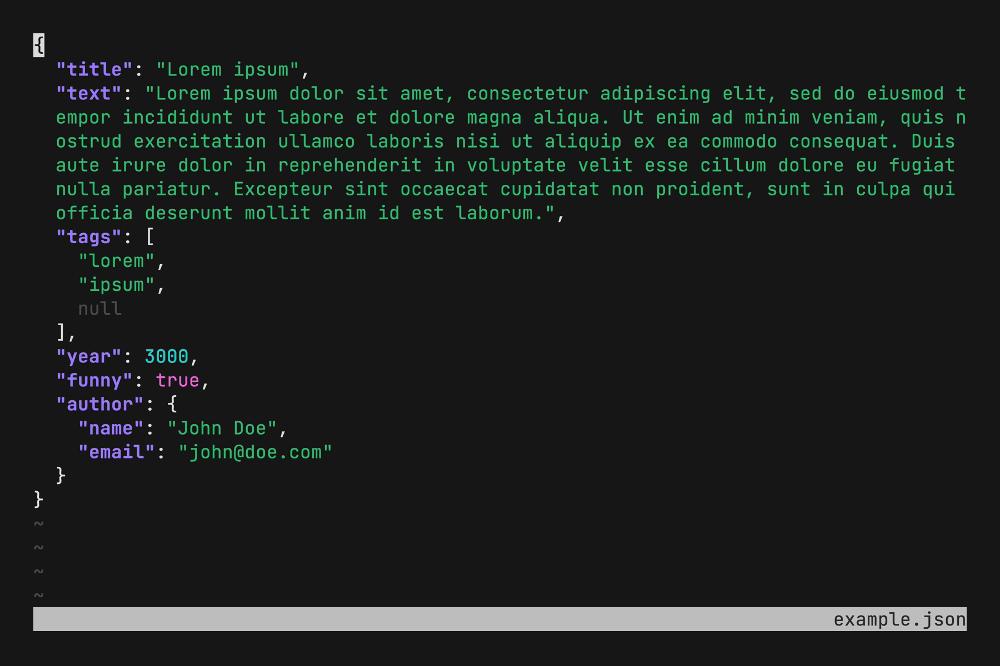

# f(x)

## Documentation

See full documentation at [fx.wtf](https://fx.wtf).

## Related

- [walk](https://github.com/antonmedv/walk) – terminal file manager
- [howto](https://github.com/antonmedv/howto) – terminal command LLM helper
- [countdown](https://github.com/antonmedv/countdown) – terminal countdown timer

## License

[MIT](LICENSE)
