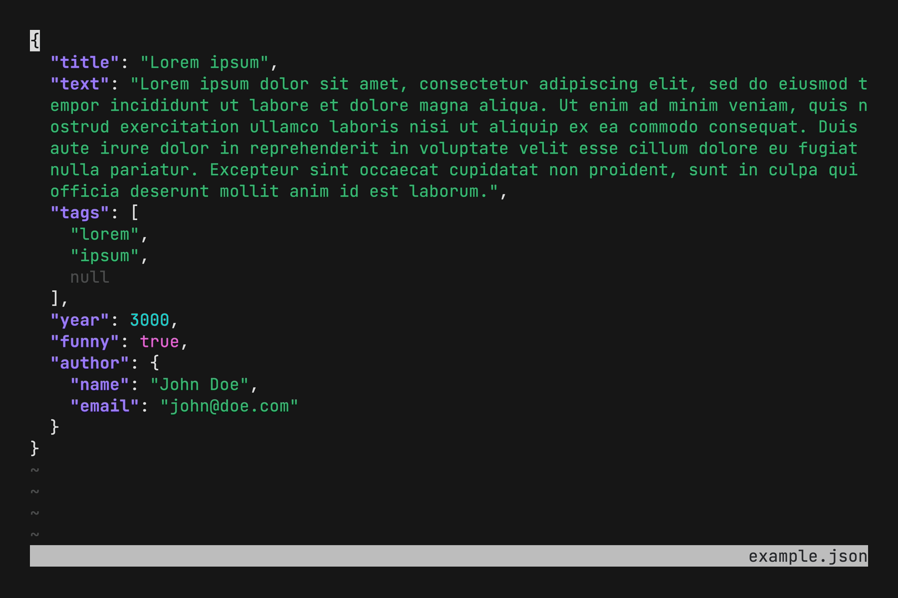

# f(x)

## Documentation

See full documentation at [fx.wtf](https://fx.wtf).

To pretty-print without opening the interactive viewer, use `fx --no-paging data.json`
or `cat data.json | fx --no-paging`. Setting `FX_NO_PAGER` enables the same behavior:
`cat data.json | FX_NO_PAGER=1 fx`. With no expression, this is equivalent to passing
`.`; explicit expressions and input-format flags continue to work as usual.

## Related

- [walk](https://github.com/antonmedv/walk) – terminal file manager
- [howto](https://github.com/antonmedv/howto) – terminal command LLM helper
- [countdown](https://github.com/antonmedv/countdown) – terminal countdown timer

## License

[MIT](LICENSE)
